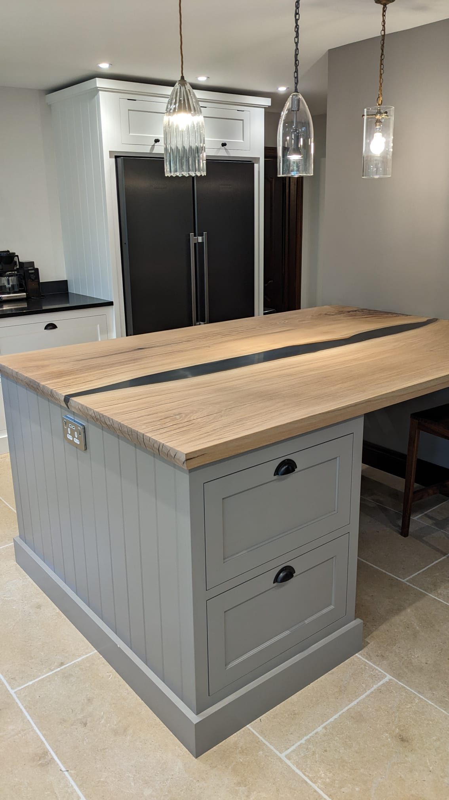
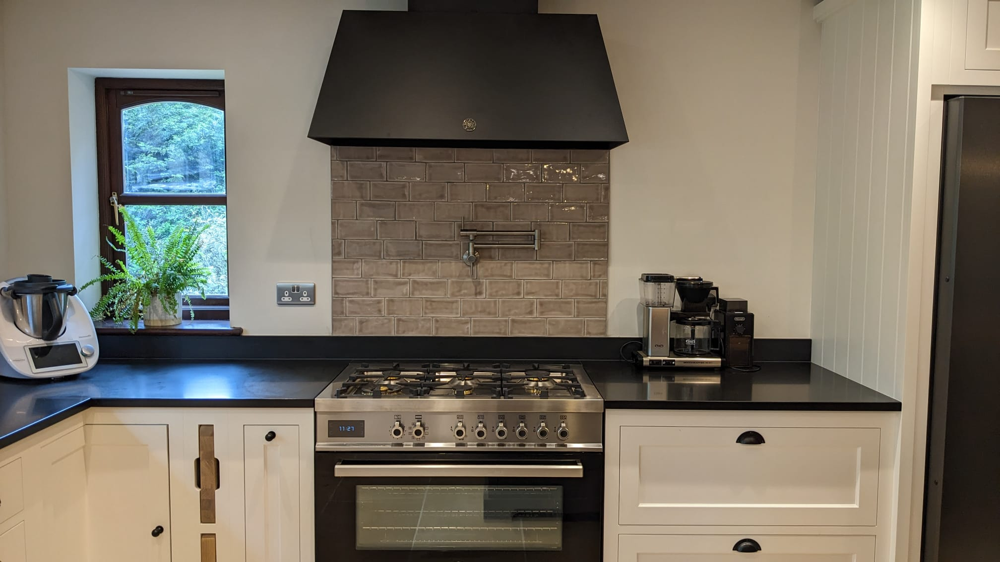

# Kitchen Renovation

Sorry, this is going to take a minute to load...

## Original Kitchen

When we moved in to the house in 2020 we knew we wanted to make 
some changes to the kitchen. It was clearly two rooms at one point 
that were joined up to make a larger kitchen.

In December 2020 put a splash of paint on and some minor upgrades to make it 
useable while we figured out what we really wanted. 

## kitchen peninsula

Jan 2023 I found some amazing slabs of oak to make a kitchen 
worktop out of which set this all in motion.

## demo 

We stripped back to bare floor and studs

## flooring

Installed underfloor heating and some large format limestone tiles

## Finished product

As much as I wanted to make all of the cabinets from scratch we ended up buying 
the base cabinets in which made the project achievable with few months of hard 
work the kitchen is nearly finished.

## Dog Tax

Even the dog got a new house under the stairs

